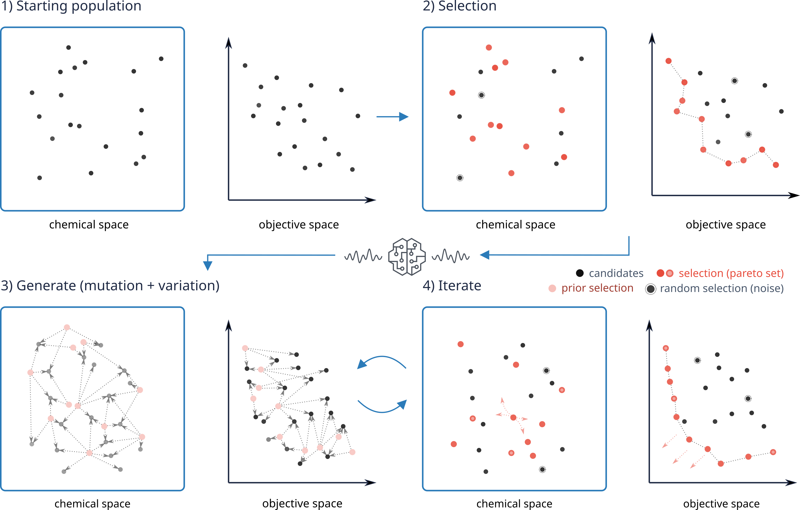

# Module for Evolutionary Generative AI-based Virtual Screening

Code accompanying the paper "Evolutionary Exploration of Drug-like Chemical Space Utilizing Generative AI and Virtual Screening" (Preprint on bioRxiv: Secker et al. 2026 https://doi.org/10.64898/2026.03.26.714527).

The code referenced in the paper is described in this repository and can be used to reproduce the results of the paper. In the paper it was applied to identify pH-specific ligands of the µ-opioid receptor (MOR).
<table bgcolor="white" cellpadding="20" style="border-radius: 10px; overflow: hidden;">
  <tr>
    <td>
      
    </td>
  </tr>
</table>
<p></p>

# Installation and Setup

The workflow described in Secker et al. 2026 (https://doi.org/10.64898/2026.03.26.714527) uses several external programs and tools, including: 

| Module | Usage | Author(s) | Source |
|---|---|---|---|
| VirtualFlow for Ligand Preparation (VFLP) | ligand preparation | Gorgulla et al. 2020 and 2023 | https://github.com/csecker/VFLP |
| VirtualFlow for Virtual Screening (VFVS) | molecular docking | Gorgulla et al. 2020 and 2023 | https://github.com/csecker/VFVS |
| VirtualFlow Tools (VFTools) | data handling | Gorgulla et al. 2020 and 2023 | https://github.com/VirtualFlow/VFTools |
| REINVENT randomized | generative model | Arús-Pous et al. 2019 | https://github.com/undeadpixel/reinvent-randomized |
| STONED algorithm | rule-based generator | Nigam et al. 2021 | https://github.com/the-matter-lab/stoned-selfies |
| GPUSimilarity | fast similarity search | Schrödinger Inc. | https://github.com/schrodinger/gpusimilarity |
| Open Babel | conformer generation | O'Boyle et al. 2011 | https://github.com/openbabel/openbabel |
| QupKake | pKa calculations | Abarbanel et al. 2024 | https://github.com/Shualdon/QupKake |
|

The VirtualFlow modules, REINVENT randomized, GPUSimilarity, Open Babel and QupKake are not part of this repository and need to be installed separately from the respective repositories. If you want to use MolConvert from Chemaxon® instead of Open Babel for conformer generation in the ligand preparation step, you have to obtain a license from Chemaxon® (https://www.certara.com/chemaxon).

Additionally, the workflow uses a molecular building block/fragment database to perform the described fragment compatibility search with Enamine building blocks using GPUSimilarity. The database can be requested from e.g. Chemspace Ltd. or Enamine Ltd. (https://enamine.net/building-blocks/building-blocks-catalog).

# Generative Model Pretraining and Sampling
As a molecular generative model the workflow used REINVENT randomized by Arús-Pous et al. 2019 (https://doi.org/10.1186/s13321-019-0393-0), a derivative of the REINVENT molecular generative model initially published by Olivecrona et al. 2017 (https://doi.org/10.1186/s13321-017-0235-x). Model pretraining was performed following the authors' instructions using the provided <a href="https://github.com/undeadpixel/reinvent-randomized/blob/df63cab67df2a331afaedb4d0cea93428ef8a9f7/training_sets/chembl.training.smi">ChEMBL training dataset </a>:

```
./create_randomized_smiles.py -i training_sets/chembl.training.smi -o chembl_randomized/training -n 100
./create_randomized_smiles.py -i training_sets/chembl.validation.smi -o chembl_randomized/validation -n 100
./create_model.py -i chembl_randomized/training/001.smi -o chembl_randomized/models/model.empty
./train_model.py -i chembl_randomized/models/model.empty -o chembl_randomized/models/model.trained -s chembl_randomized/training -e 100 --lrm ada --csl chembl_randomized/tensorboard --csv chembl_randomized/validation --csn 75000
```

Sampling of the model for e.g. generating 1,000 molecules in can be performed with:<br />

`./sample_from_model.py -m chembl_randomized/models/model.trained.100 -o output.smi -n 1000`

# Generating the starting population

To generate the starting population (we used 1,000) of molecules, one can use the generate functionality of the module `evogenais`. First, we need to configure the workflow by creating a copy of the config template and adjusting the respective config values:

```bash
cd evogenais
cp template.config.json config.json
```

# Preparation of ligand collections

To prepare the sampled SMILES for ligand preparation with VFLP, the library has to be transformed into a format that is compatible with VirtualFlow (also see https://docs.virtual-flow.org/documentation-af/documentation/backgrounds-and-principles/input-and-output-databases). To prepare a list of SMILES for ligand preparation with VFLP we can use one of the VFTools scripts (e.g. from https://github.com/VirtualFlow/VFTools/tree/vftools-2):

```bash
./vflp_prepare_inputdb_splitting.sh 'AAAAAA.smi' smi 500 false tranche_collection zip
```


# Ligand Preparation and Virtual Screening

For ligand preparation and virtual screening we use VirtualFlow (https://virtual-flow.org) for Ligand Preparation (VFLP) and VirtualFlow for Virtual Screening (VFVS). The modules can be obtained here: 

- https://github.com/VirtualFlow
- https://github.com/csecker/VFVS
- https://github.com/csecker/VFLP

A library of sampled molecules can be prepared for ligand preparation using VirtualFlow Tools (VFTools): https://github.com/VirtualFlow/VFTools
The documentation on how to prepare ligands and screen them using VirtualFlow is available here:

- https://docs.virtual-flow.org/documentation-vf1
- https://docs.virtual-flow.org/documentation-vf2

# Iterative molecule generation and docking-result ranking.

After virtually screening the initially sampled molecules (starting population of e.g. 1,000 molecules), one can use the following command line interface (CLI) to perform docking results extraction from VirtualFlow for Virtual Screening (VFVS) and ranking according to the e.g. the scalarized weighted sum average was described in Secker et al. 2026 (https://doi.org/10.64898/2026.03.26.714527).

## Installation

```bash
python -m venv .venv
source .venv/bin/activate
python -m pip install -e .
```

## Configuration

```bash
cp config.template.json config.json
```

All relative paths in `config.json` are resolved relative to the config file,
not relative to the terminal's current directory.

Important paths:

- `output_root`: ranking and generated-output directory.
- `ranking_file`: current ordered ranking used as generation input.
- `vfvs_output_glob`: pattern ending at the VFVS `output-files` directory,
  for example `/data/runs/VFVS*/output-files`.
- `vflp_folder_paths`: glob for VFLP JSON result files.
- `mcf_file`, `wehi_pains_file`, `pains_file`: structural-filter databases.

## Execution

All available command can be found via

```bash
evogenais --help
```

`generate` and `run` read the configured ranking in its existing order, remove blank and duplicate SMILES, round the selected count upward, and write the top percentage to ligand collections, which can again be used for ligand preparation and docking with VirtualFlow.

After the initial screening of the starting population, we performed the `evogenais run` command, which performs

- ranking of the docking results
- model fine-tuning
- generation of novel molecules

```bash
evogenais rank --config config.json --iteration 1
```

The ranking and generation steps can also be executed separately:

```bash
evogenais rank --config config.json --iteration 2
evogenais generate --config config.json --iteration 2 --top-percent 10
```

The module can also be executed without installation via:

```bash
python -m evogenais --help
```
